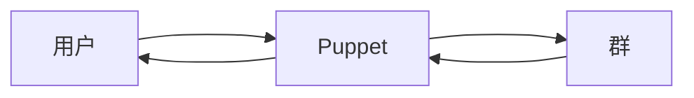

# Nonebot Plugin Puppet

基于 [nonebot2](https://github.com/nonebot/nonebot2) 和 [go-cqhttp](https://github.com/Mrs4s/go-cqhttp) 的会话转接插件

[](LICENSE)


## 安装

### 从 PyPI 安装（推荐）

- 使用 nb-cli  

```shell
nb plugin install nonebot_plugin_puppet
```

- 使用 poetry

```shell
poetry add nonebot_plugin_puppet
```

- 使用 pip

```shell
pip install nonebot_plugin_puppet
```

### 从 GitHub 安装（不推荐）

```shell
git clone https://github.com/Jigsaw111/nonebot_plugin_puppet.git
```

## 使用

**仅限超级用户使用**

**不建议同时链接多个会话（尤其是大群），如被风控概不负责**

- `puppet ln/link`链接会话
  - `-u user_id..., -ua user_id..., --user-a user_id...`可选参数，指定源会话的 QQ 号
  - `-g group_id..., -ga group_id..., --group-a group_id...`可选参数，指定源会话的群号
    至少需要设置一个
  - `-ub user_id..., --user-b user_id...`可选参数，指定链接会话的 QQ 号
  - `-gb group_id..., --group-b group_id...`可选参数，指定链接会话的群号
    不设置的话默认为当前会话的 QQ 号/群号
  - `-q, --quiet`可选参数，静默链接（不发送链接成功消息）
  - `-U, --unilateral`可选参数，单方面链接
- `puppet rm/unlink`删除会话链接
  - `-u user_id..., -ua user_id..., --user-a user_id...`可选参数，指定源会话的 QQ 号
  - `-g group_id..., -ga group_id..., --group-a group_id...`可选参数，指定源会话的群号
    不设置的话，默认为当前会话链接的所有会话
  - `-ub user_id..., --user-b user_id...`可选参数，指定链接会话的 QQ 号
  - `-gb group_id..., --group-b group_id...`可选参数，指定链接会话的群号
    不设置的话默认为当前会话的 QQ 号/群号
  - `-q, --quiet`可选参数，静默链接（不发送解除链接成功消息）
  - `-U, --unilateral`可选参数，单方面解除链接
- `puppet ls/list` 查看链接到当前会话的会话列表
  - `-u user_id, --user user_id` 互斥参数，指定会话的 QQ 号
  - `-g group_id, --group group_id` 互斥参数，指定会话的群号
    不设置的话默认为当前会话的 QQ 号/群号
- `puppet send message` 向指定会话发送消息，支持 CQ 码
  - `message` 需要发送的消息，支持 CQ 码，如含空格请用 `""` 包裹
  - `-u user_id..., --user user_id...`可选参数，指定接收会话的 QQ 号
  - `-g group_id..., --group group_id...`可选参数，指定接收会话的群号
    不设置的话默认为当前会话链接的所有会话
  - `--a, --all`可选参数，指定所有群聊
- `puppet aprv/approve` 同意请求/邀请
  - `-f flag..., --flag flag...`可选参数，指定请求的 flag
  - `--a, --all`可选参数，指定所有请求
- `puppet rej/reject` 拒绝请求/邀请
  - `-f flag..., --flag flag...`可选参数，指定请求的 flag
  - `--a, --all`可选参数，指定所有请求
- `puppet exit` 退出指定群聊
  - `-g group_id..., --group group_id...`可选参数，指定要退出的群号

## Bug

- [x] 不允许多个超级用户链接到同一会话
- [x] 如果指定的会话不在会话列表里会产生错误

## To Do

- [x] 允许单向转接
- [x] 转接请求事件
- [x] 提供退群功能
- [ ] 提供默认设置

## 原理


